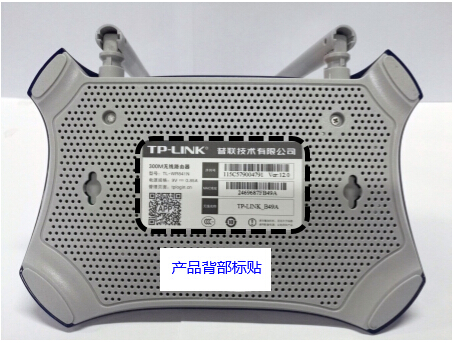

#####   登录路由器的管理界面
在路由器壳体背面的标贴纸上，可以查看到管理页面或管理IP，这个地址就是用来登录路由器的地址。 

 

打开浏览器在浏览器中输入路由器管理地址，输入路由器的管理密码（对于较老版本的路由器要求输入用户名和密码）后，点击登录/确认按钮，就可以登录到路由器的管理界面了。 

 
提示：点击登录/确认按钮无反应、登录界面显示不完整或者重复提示输入密码，请更换浏览器尝试。

#####   设置路由器的Wi-Fi
点击“路由设置”进入界面后，再点击“无线设置”,来设置路由器的Wi-Fi。 

 
1、Wi-fi名称不能有中文。 2、无线模式使用Bg模式。 3、具有5G功能的路由器，要关闭2.4G和5G的混频，使用2.4G 频段的wifi。 4、有的路由器具有“防蹭网”功能，要关闭这个功能。 设置完毕后，点击“保存”按钮。  
再点击“DHCP服务器”按钮进入界面，打开路由器的“DHCP”功能，点击“保存”按钮。 

